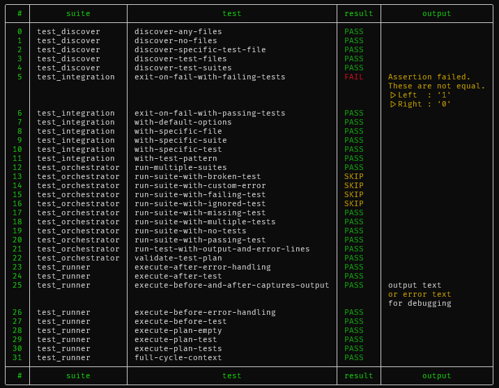

# nu-test

A Nushell test runner.



## Motivation

Nushell doesn't include a test runner for Nu scripts in the standard library. As a shell language, writing the odd script is Nushell's raison d'être. This project aims to encourage writing tests for those scripts by making testing extremely accessible.

The hope is that this runner will be accepted into the Nushell standard library as the value of this is much diminished if the test runner needs to be obtained separately.

Hopefully this project has been archived by the time you read this!

## Writing Tests

**nu-test** uses command description as a tag system for tests, test discovery will ignore non-tagged commands.
For now it support:
| tag | description |
| - | - |
| **\[test\]** | this is the main tag to annotate tests.| 
| **\[before-all\]** | this is run once before all tests.|
| **\[before-each\]** | this is run before each test.|
| **\[after-all\]** | this is run once before all tests.|
| **\[after-each\]** | this is run after each test.|
| **\[ignore\]** | ignores the test but still collects it, similar to `todo` in other test runners.|

For example:

```nuhshell
use std assert

#[before-each]
def setup [] {
  print "before each"
  {
    data: "xxx"
  }
}

#[test]
def "some-data is xxx" [] {
  let context = $in
  print $"Running test A: ($context.data)"
  assert equal "xxx" $context.data
}

#[test]
def "is one equal one" [] {
  print $"Running test B: ($in.data)"
  assert equal 1 1
}

#[test]
def "is two equal two" [] {
  print $"Running test C: ($in.data)"
  assert equal 2 2
}

#[after-each]
def cleanup [] {
  let context = $in
  print "after each"
  print $context
}```

Will return:
```
╭───────────┬──────────────────┬────────┬─────────────────────╮
│   suite   │       test       │ result │       output        │
├───────────┼──────────────────┼────────┼─────────────────────┤
│ test_base │ is one equal one │ PASS   │ before each         │
│           │                  │        │ Running test B: xxx │
│           │                  │        │ after each          │
│           │                  │        │ {data: xxx}         │
│ test_base │ is two equal two │ PASS   │ before each         │
│           │                  │        │ Running test C: xxx │
│           │                  │        │ after each          │
│           │                  │        │ {data: xxx}         │
│ test_base │ some-data is xxx │ PASS   │ before each         │
│           │                  │        │ Running test A: xxx │
│           │                  │        │ after each          │
│           │                  │        │ {data: xxx}         │
╰───────────┴──────────────────┴────────┴─────────────────────╯
```

## Current Features

Supports tests scripts in flexible configurations:
- Single file with both implementation and tests
- Separate implementation and test files
- Just test files only
  - This would commonly be the case when using Nushell to test other things, such as for testing bash scripts, APIs, infrastructure. All the things Nushell is great at.
- Nushell modules.

Nushell scripts being tested can either be utilised from their public interface as a module via `use <test-file>.nu` or it's private interface by `source <test-file>.nu`.

Fast. Runs test suites (a file of tests) and each test in parallel with minimal Nu subshells.

Allows before/after each/all to generate context for each test.

Emits tests as a table of results that can be processed like normal Nu data. For example, you can filter the results to show only failed tests using:
```nu
test --no-color | where result == FAIL
```

Allows filter of suites and tests to run via a pattern, such as:
```nu
test --match-suites api --match-tests test[0-9]
```
This will run all files that include `api` in the name and tests that start with `test` followed by a digit.

Capture and display stdout and stderr in output for debugging.

In normal operation the tests will be run and the results will be returned as a table with the exit code always set to 0. To avoid manually checking the results, the `--fail` flag can be used to set the exit code to 1 if any tests fail. In this mode, the test results will be printed in the default format and cannot be interrogated.
```nu
test --fail
```

## Roadmap

- List tests without running them.
- Test report in standard format (cargo test JSON or nextest / JUnit XML)
- Generate test coverage (in llvm-cov format to allow combining with Nushell coverage)
- Allow custom reporters
  - Also document use of store to translate from event to collected data.

## Future Ideas

- More sophisticated change display rather than simple assertion module output, e.g. differences in records and tables, perhaps displayed as tables
- Fluent assertion module with pluggable matchers.
- Test timing.
- Funky dynamic terminal UI.
- Exclusions of suite and/or tests.
- File stem pattern for gobbing to allow running tests in any file not just test ones
- Optionally allow running ignored tests.
- Stream test results. Each suite is run in a separate nu process via `complete` and therefore each suite's results are not reported until the whole suite completed. There are some limitations here due to Nushell not being able to run processes concurrently. However, we may be able to stream the events and avoid the `complete` command to resolve this. This is ideally required for the event-based terminal UI.
- Per-suite concurrency control (e.g. `#[sequential]` or `#[disable-concurrency]` annotation). This would also avoid the need for separate test_store_success suits and use of subshells in own tests.
- There is some simplicity in the current design that means after-each processing may not happen if before commands fail:
  - Currently, a test will be marked as failed on the first before-each that fails, the test will not be run and neither will the after-each. So a before-each that creates temporary files before a failure will not be removed.   
  - Similarly, execution will stop on the first after-each that fails.
  - We could try to accumulate as much context as possible, but it doesn't seem worth it.

## Alternatives

Nushell has its own private runner for the standard library `testing.nu`.

There is also a runner in [nupm](https://github.com/nushell/nupm), the Nushell package manager.

Both of these runners work on modules and so cannot be used for testing independent scripts. This runner is generic. It works with any Nu script, be that single files or modules.


## How Does It Work?

Nutest discovers tests by scanning matching files in the path, sourcing that code and collecting test annotations on methods via `scope commands`. The file patterns currently detected are only `test_*.nu` and `*_test.nu` for performance of the test discovery. The latter pattern is useful when you're using Nushell to test other things so the file is alphabetically ordered close to the files being tested.

For each file with tests (a suite), dispatch the suite to run on a single Nu subshell.

Capture test success and failure as well as any output (by overriding print command) and stream as test events on stdout.

Collate all events for all suites and tests being run print the test results table.

### Concurrency

Tests written in Nutest are run concurrently by default. Assuming your tests need to run in parallel is a good design constraint for self-contained tests that run efficiently. However, if this is not practical, this can be disabled by specifying the `--threads=1` option to the `test` command.

There are two levels of concurrency used in Nutest, leveraging `par-each`, where the following are run concurrently:
- Suites (file of tests).
- Tests within a suite.

This means that an 8-core CPU would run 8 suites concurrently and within each suite, it would run 8 tests in concurrently. This might suggest Nutest potentially causing excessive CPU context switching, and the run taking longer than is strictly needed. However, this is not necessarily the case as Nushell leverages [Rayon](https://github.com/rayon-rs/rayon) for `par-test`, which purports to be efficient at managing the number of threads and of scheduling work across available CPU cores. For more on this, see Rayon's notion of [potential concurrency](https://smallcultfollowing.com/babysteps/blog/2015/12/18/rayon-data-parallelism-in-rust/), the dynamic nature of it's [parallel iterators](https://github.com/rayon-rs/rayon?tab=readme-ov-file#parallel-iterators-and-more) and the underlying use of Rust's [available parallelism](https://doc.rust-lang.org/stable/std/thread/fn.available_parallelism.html). However, it#s still not clear how well this works across multiple processes.

Additionally, given the kinds of use-cases Nushell is used for, many tests are likely to be I/O bound.

Feedback on how well this works in practice is very welcome.

#### SQLite

Given Nutest runs as much as possible concurrently, this puts an unusual level of pressure on SQLite that collects test results and the output. For this reason, INSERTs sometimes fail and so a retry mechanism has been added to attempt to insert the data again up to a particular maximum tries at which point Nutest may give up and throw an error. The retries have had some stress testing to come to a pragmatic value, but please let us know if you're seeing issues.
