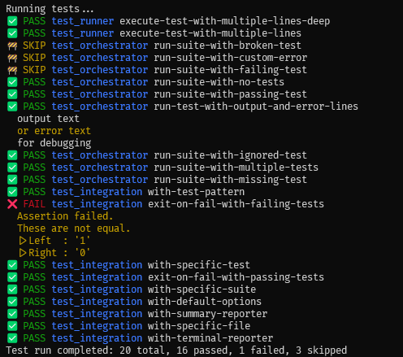

# Nutest

A Nushell test runner.


*^ Tests are structured data that can be processed just like any other table.*



*^ Terminal mode - test results appear as they complete.*

## Requirements

Nushell 0.101.0 or later.

## Motivation

Writing tests in Nushell is both powerful and expressive. Not only for testing Nushell code, but also other things, such as APIs, infrastructure, and other scripts. However, Nushell doesn't currently include a test runner for Nu scripts in the standard library. While a runner is not strictly necessary, Nutest aims to encourage writing tests for scripts by making testing more easily accessible.

## Writing Tests

**nu-test** uses command description as a tag system for tests, test discovery will ignore non-tagged commands.
For now it support:
| tag | description |
| - | - |
| **\[test\]** | this is the main tag to annotate tests.| 
| **\[before-all\]** | this is run once before all tests.|
| **\[before-each\]** | this is run before each test.|
| **\[after-all\]** | this is run once after all tests.|
| **\[after-each\]** | this is run after each test.|
| **\[ignore\]** | ignores the test but still collects it, similar to `todo` in other test runners.|

For example:

```nu
use std assert

#[before-each]
def setup [] {
  print "before each"
  {
    data: "xxx"
  }
}

#[test]
def "some-data is xxx" [] {
  let context = $in
  print $"Running test A: ($context.data)"
  assert equal "xxx" $context.data
}

#[test]
def "is one equal one" [] {
  print $"Running test B: ($in.data)"
  assert equal 1 1
}

#[test]
def "is two equal two" [] {
  print $"Running test C: ($in.data)"
  assert equal 2 2
}

#[after-each]
def cleanup [] {
  let context = $in
  print "after each"
  print $context
}
```

Will return:
```
╭───────────┬──────────────────┬────────┬─────────────────────╮
│   suite   │       test       │ result │       output        │
├───────────┼──────────────────┼────────┼─────────────────────┤
│ test_base │ is one equal one │ PASS   │ before each         │
│           │                  │        │ Running test B: xxx │
│           │                  │        │ after each          │
│           │                  │        │ {data: xxx}         │
│ test_base │ is two equal two │ PASS   │ before each         │
│           │                  │        │ Running test C: xxx │
│           │                  │        │ after each          │
│           │                  │        │ {data: xxx}         │
│ test_base │ some-data is xxx │ PASS   │ before each         │
│           │                  │        │ Running test A: xxx │
│           │                  │        │ after each          │
│           │                  │        │ {data: xxx}         │
╰───────────┴──────────────────┴────────┴─────────────────────╯
```

## Current Features

### Flexible Tests

Supports tests scripts in flexible configurations:
- Single file with both implementation and tests
- Separate implementation and test files
- Just test files only
  - This would commonly be the case when using Nushell to test other things, such as for testing bash scripts, APIs, infrastructure. All the things Nushell is great at.
- Nushell modules.

Nushell scripts being tested can either be utilised from their public interface as a module via `use <test-file>.nu` or testing their private interface by `source <test-file>.nu`.

### Context and Setup/Teardown

Specify before/after for each test via `[before-each]` and `[after-each]` annotations, or for all tests via `[before-all]` and `[after-all]`.

These setup/teardown commands can also be used to generate contexts used by each test, see Writing Tests section for ane example.

### Filtering

Allows filter of suites and tests to run via a pattern, such as:
```nu
run-tests --match-suites api --match-tests test[0-9]
```
This will run all files that include `api` in the name and tests that contain `test` followed by a digit.

### Reporting

By default, there is the terminal reporter that outputs the test results as they complete. This is useful for long-running tests where you want to see the results as they happen.

It is also possible to emit test results as a normal data table that can be processed like other Nushell data. For example, you can filter the results to show only tests that need attention using:
```nu
run-tests --reporter table | where result in [SKIP, FAIL]
```

See screenshots above for examples of the output (in that case using `--reporter table-pretty`).

Finally, there is a reporter that just shows the summary of the test run:
```nu
run-tests --reporter summary
```
Will return:
```
╭─────────┬────╮
│ total   │ 54 │
│ passed  │ 50 │
│ failed  │ 1  │
│ skipped │ 3  │
╰─────────┴────╯
```

### Test Output

Output from the `print` command to stdout and stderr will be captured and shown against test results, which is useful for debugging failing tests.


### CI/CD Support

In normal operation the tests will be run and the results will be returned as a table with the exit code always set to 0. To avoid manually checking the results, the `--fail` flag can be used to set the exit code to 1 if any tests fail. In this mode, the test results will be printed in the default format and cannot be interrogated.

```nu
run-tests --fail
```

This is useful for CI/CD pipelines where it is desirable to fail the current
job. However, note that using this directly in your shell will exit your shell session!

### Concurrency

Tests written in Nutest are run concurrently by default.

This is a good design constraint for self-contained tests that run efficiently. The default concurrency strategy is geared for CPU-bound tests, maximising the use of available CPU cores. However, some cases may need adjustment to run efficiently. For example, IO-bound tests may benefit from lower concurrency and tests waiting on external resources may benefit by not being limited to the available CPU cores.

The level of concurrency adjusted or even disabled by specifying the `--strategy { threads: <n> }` option to the `run-tests` command, where `<n>` is the number of concurrently executing machine threads. The default is handling the concurrency automatically.

See the Concurrency section under How Does It Work? for more details.

The concurrency level can also be specified at the suite-level by way of a `strategy` annotation. For example, the following strategy will run all tests in the suite sequentially:

```nu
#[strategy]
def threads []: nothing -> record {
  { threads: 1 }
}
```

This would be beneficial in a project where most tests should run concurrently by default, but a subset perhaps require exclusive access to a resource, or one that needs resetting on a per-test basis.

## Roadmap

- Handling of data formats and flexible rendering
  - Allow testing output as list<any> rather than just lines
  - This implies rendering is a very-last stage process
- Handle output from before/after all (ignore it? repeat for every test? custom event?)
- Test execution of external tools wrt to terminal output
  - This might need to be flagged to run in a separate process?
- Fluent assertion module with pluggable matchers.
- GitHub Actions for nu-test itself
- Test report in standard format (cargo test JSON or nextest / JUnit XML)
- Generate test coverage (in llvm-cov format to allow combining with Nushell coverage)

## Future Ideas

- Detect flaky tests by re-running failed tests a few times.
- More sophisticated change display rather than simple assertion module output, e.g. differences in records and tables, perhaps displayed as tables
  - Perhaps highlight differences in output using background colours like a diff tool.
- Allow custom reporters
  - Also document use of store to translate from event to collected data.
- Test timing.
- Dynamic terminal UI, showing the currently executing suites and tests.
  - This will resolve not being able to see the currently running tests in the terminal reporter
  - Would include things like a progress bar, running total of completed, fails, skips, etc.
  - If we save historical test run timings, we should also estimate time left
- Exclusions of suite and/or tests.
- File stem pattern for gobbing to allow running tests in any file not just test ones
- Optionally allow running ignored tests.
- Stream test results. Each suite is run in a separate nu process via `complete` and therefore each suite's results are not reported until the whole suite completed. There are some limitations here due to Nushell not being able to run processes concurrently. However, we may be able to stream the events and avoid the `complete` command to resolve this. This is ideally required for the event-based terminal UI.
- Per-suite concurrency control (e.g. `#[sequential]` or `#[disable-concurrency]` annotation). This would also avoid the need for separate test_store_success suits and use of subshells in own tests.
- There is some simplicity in the current design that means after-each processing may not happen if before commands fail:
  - Currently, a test will be marked as failed on the first before-each that fails, the test will not be run and neither will the after-each. So a before-each that creates temporary files before a failure will not be removed.   
  - Similarly, execution will stop on the first after-each that fails.
  - We could try to accumulate as much context as possible, but it doesn't seem worth it.

## Alternatives

Nushell has its own private runner for the standard library `testing.nu`.

There is also a runner in [nupm](https://github.com/nushell/nupm), the Nushell package manager.

Both of these runners work on modules and so cannot be used for testing independent scripts. This runner is generic. It works with any Nu script, be that single files or modules.


## How Does It Work?

Nutest discovers tests by scanning matching files in the path, sourcing that code and collecting test annotations on methods via `scope commands`. The file patterns currently detected are only `test_*.nu` and `*_test.nu` for performance of the test discovery. The latter pattern is useful when you're using Nushell to test other things so the file is alphabetically ordered close to the files being tested.

Each test file, which include multiple tests (a suite) is dispatched to run on a single Nu subshell.

Test results are captured using encoded events written to stdout (one event per line), which carry all the required context indicating what suite and test it is associated with, allowing tests to be run in parallel.

Success and failure events are implied by an error being thrown, such as an assertion failure.

Output from tests is captured by aliasing the print command. This may include structured data, which is preserved in the event data. This is achieved by converting each item sent to a print command as nuon and then encoding as base64, which ensures a single line event is emitted even if it contains multi-line text.

All events for all suites and tests being run are then collated, ready to use within a reporter to present to the user with flexible output and rendering.

### Concurrency

Nutest runs both test suites (a file of tests) and each test in parallel with minimal Nu subshells.

There are two levels of concurrency used in Nutest, leveraging `par-each`, where the following are run concurrently:
- Suites (file of tests).
- Tests within a suite.

This means that an 8-core CPU would run 8 suites concurrently and within each suite, it would run 8 tests in concurrently. This might suggest Nutest potentially causing excessive CPU context switching, and the run taking longer than is strictly needed. However, this is not necessarily the case as Nushell leverages [Rayon](https://github.com/rayon-rs/rayon) for `par-test`, which purports to be efficient at managing the number of threads and of scheduling work across available CPU cores. For more on this, see Rayon's notion of [potential concurrency](https://smallcultfollowing.com/babysteps/blog/2015/12/18/rayon-data-parallelism-in-rust/), the dynamic nature of it's [parallel iterators](https://github.com/rayon-rs/rayon?tab=readme-ov-file#parallel-iterators-and-more) and the underlying use of Rust's [available parallelism](https://doc.rust-lang.org/stable/std/thread/fn.available_parallelism.html). However, it#s still not clear how well this works across multiple processes.

Additionally, given the kinds of use-cases Nushell is used for, many tests are likely to be I/O bound.

Feedback on how well this works in practice is very welcome.

### SQLite

Given Nutest runs as much as possible concurrently, this puts an unusual level of pressure on SQLite that collects test results and the output. For this reason, INSERTs sometimes fail and so a retry mechanism has been added to attempt to insert the data again up to a particular maximum tries at which point Nutest may give up and throw an error. The retries have had some stress testing to come to a pragmatic value, but please let us know if you're seeing issues.
